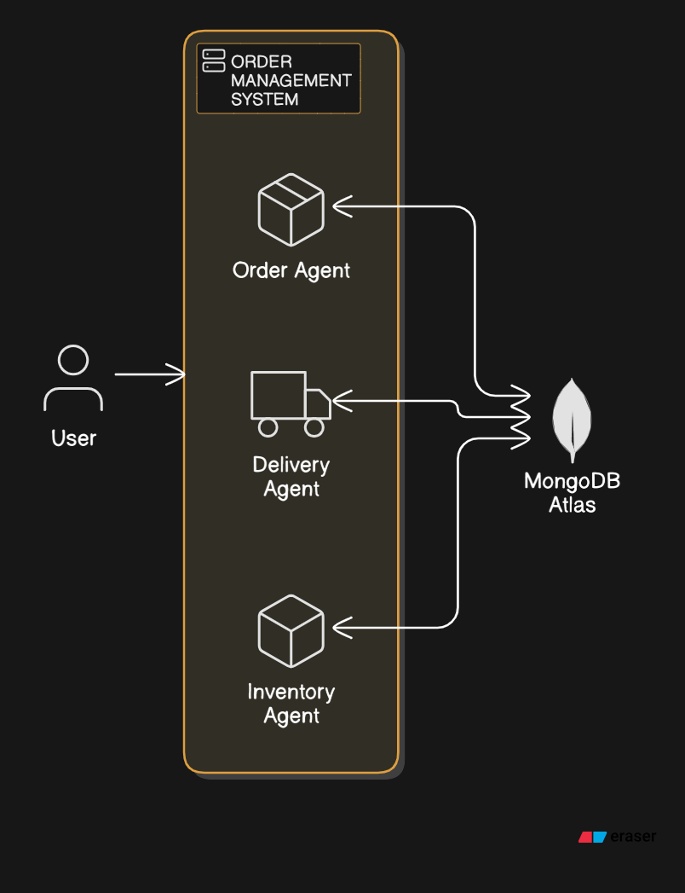

# Agentic_OMS

Agentic_OMS is a multi-agent order management system designed to streamline the process of managing product orders, inventory, and delivery status using automated agents.

## Features

- **Order Management**: Handles the creation and processing of orders.
- **Inventory Management**: Manages product inventory, including checking stock and updating stock levels.
- **Delivery Management**: Manages the delivery status of orders.

## Classes and Components


### OrderManagementSystem

The `OrderManagementSystem` class is responsible for creating and managing agents that handle different aspects of order processing.

#### Attributes

- `model`: The language model used by the agents.
- `inventory_agent`: An agent responsible for managing inventory.
- `order_agent`: An agent responsible for creating orders.
- `delivery_agent`: An agent responsible for managing delivery status.
- `manager`: A manager agent that coordinates the other agents and processes orders.

## Installation
1. Clone the repository:
   ```bash
   git clone https://github.com/yourusername/Agentic_OMS.git
   ```
2. Navigate to the project directory:
   ```bash
   cd Agentic_OMS
   ```
3. Install dependencies:
   ```bash
   pip install -r requirements.txt
   ```

#### Methods

- `__init__(self, model_id: str = MODEL_ID)`: Initializes the order management system and its agents.
- `process_order(self, orders: List[Dict]) -> str`: Processes a set of orders by creating order documents, updating inventory, and setting delivery status.

## Usage

To use the `OrderManagementSystem`:

1. Initialize the system with a model ID.
2. Create and configure the agents for inventory, orders, and delivery.
3. Use the `process_order` method to process orders and update the system.

```python
from agentic_oms import OrderManagementSystem

# Initialize the system
oms = OrderManagementSystem(model_id="your_model_id")

# Process orders
orders = [
    {"address": "123 Main St", "products": ["Product A", "Product B"]},
    {"address": "456 Elm St", "products": ["Product C"]}
]
result = oms.process_order(orders)

print(result)
```

# License
This project is licensed under the MIT License. See the LICENSE file for more details.

# Contributing
Contributions are welcome! Please submit pull requests or open issues for any enhancements or bug fixes.

Let me know if there are any specific details you would like to add or modify!